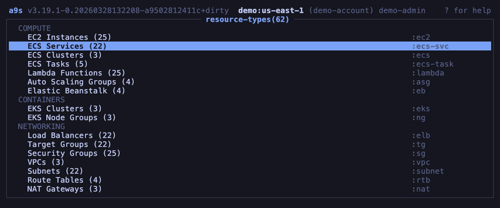

# a9s - Terminal UI for AWS

**Like k9s, but for your cloud.**

[](https://github.com/k2m30/a9s/actions/workflows/ci.yml)
[](https://goreportcard.com/report/github.com/k2m30/a9s)
[](https://github.com/k2m30/a9s/releases/latest)
[](https://www.gnu.org/licenses/gpl-3.0)
[](https://github.com/k2m30/a9s/releases)
[](https://codecov.io/gh/k2m30/a9s)



Browse, inspect, and manage 62 AWS resource types from your terminal. a9s gives you a real-time, keyboard-driven interface to your AWS infrastructure -- no clicking through the console, no memorizing CLI flags.

**Read-only by design.** a9s never makes write calls to AWS. Safe to use in production.

**No credential storage.** a9s never reads `~/.aws/credentials`. Authentication is delegated entirely to the AWS SDK's credential chain.

**No telemetry.** a9s never phones home.

**Try without AWS.** Run `a9s --demo` to explore the full UI with synthetic data — no AWS account needed.

## Features

- **62 AWS resource types** across 12 service categories
- Real-time resource browsing with vim-style keyboard navigation
- YAML detail view for any resource (full AWS API response)
- Multi-profile and multi-region support
- Categorized menu (Compute, Storage, Database, Network, Security, CI/CD, and more)
- Column sorting by name, ID, or date
- Filter/search within resource lists
- Horizontal scrolling for wide tables
- Clipboard support (copy resource IDs and YAML)
- Tokyo Night Dark color theme
- 1,045+ unit tests

## Installation

### Homebrew (macOS and Linux)

```sh
brew install k2m30/a9s/a9s
```

### Go install

```sh
go install github.com/k2m30/a9s/cmd/a9s@latest
```

### Download binary

Download the latest release for your platform from [GitHub Releases](https://github.com/k2m30/a9s/releases/latest).

Verify the signature (optional):

```sh
cosign verify-blob --signature checksums.txt.sig checksums.txt
```

### Docker (demo)

Try a9s without installing — runs in demo mode with synthetic data:

```sh
docker run --rm -it ghcr.io/k2m30/a9s:latest --demo
```

### Build from source

```sh
git clone https://github.com/k2m30/a9s.git
cd a9s
make build
./a9s
```

Requires Go 1.26+.

## Quick Start

a9s uses the standard [AWS credential chain](https://docs.aws.amazon.com/cli/latest/userguide/cli-configure-files.html). Any of these work:
- Environment variables (`AWS_ACCESS_KEY_ID`, `AWS_SECRET_ACCESS_KEY`)
- AWS config files (`~/.aws/config`, `~/.aws/credentials`)
- EC2 instance metadata / ECS task role / SSO

```sh
a9s                       # use default profile
a9s -p production         # use a specific profile
a9s -r eu-west-1          # override region
a9s --version             # print version
```

## Supported AWS Services

| Category | Resource Types |
|----------|---------------|
| **Compute** | EC2 Instances, ECS Services, ECS Clusters, ECS Tasks, Lambda Functions, Auto Scaling Groups, Elastic Beanstalk |
| **Containers** | EKS Clusters, EKS Node Groups |
| **Networking** | Load Balancers, Target Groups, Security Groups, VPCs, Subnets, Route Tables, NAT Gateways, Internet Gateways, Elastic IPs, VPC Endpoints, Transit Gateways, Network Interfaces |
| **Databases & Storage** | DB Instances, S3 Buckets, ElastiCache Redis, DB Clusters, DynamoDB Tables, OpenSearch Domains, Redshift Clusters, EFS File Systems, RDS Snapshots, DocDB Snapshots |
| **Monitoring** | CloudWatch Alarms, CloudWatch Log Groups, CloudTrail Trails |
| **Messaging** | SQS Queues, SNS Topics, SNS Subscriptions, EventBridge Rules, Kinesis Streams, MSK Clusters, Step Functions |
| **Secrets & Config** | Secrets Manager, SSM Parameters, KMS Keys |
| **DNS & CDN** | Route 53 Hosted Zones, CloudFront Distributions, ACM Certificates, API Gateways |
| **Security & IAM** | IAM Roles, IAM Policies, IAM Users, IAM Groups, WAF Web ACLs |
| **CI/CD** | CloudFormation Stacks, CodePipelines, CodeBuild Projects, ECR Repositories, CodeArtifact Repos |
| **Data & Analytics** | Glue Jobs, Athena Workgroups |
| **Backup** | Backup Plans, SES Identities |

## Key Bindings

### Navigation

| Key | Action |
|-----|--------|
| `j` / `Down` | Move down |
| `k` / `Up` | Move up |
| `g` | Go to top |
| `G` | Go to bottom |
| `Enter` | Open / select |
| `Esc` | Back / close |
| `h` / `Left` | Scroll left |
| `l` / `Right` | Scroll right |
| `PgUp` / `Ctrl+U` | Page up |
| `PgDn` / `Ctrl+D` | Page down |

### Actions

| Key | Action |
|-----|--------|
| `d` | Detail view |
| `y` | YAML view |
| `x` | Reveal (expand) |
| `c` | Copy resource ID to clipboard |
| `/` | Filter |
| `:` | Command mode |
| `?` | Help |
| `Ctrl+R` | Refresh |
| `w` | Toggle line wrap (in YAML view) |
| `Tab` | Autocomplete (in command mode) |

### Sorting

| Key | Action |
|-----|--------|
| `N` | Sort by name |
| `I` | Sort by ID |
| `A` | Sort by date |

### General

| Key | Action |
|-----|--------|
| `q` | Quit |
| `Ctrl+C` | Force quit |

## Commands

Press `:` to enter command mode, then type a command:

| Command | Action |
|---------|--------|
| `:q` / `:quit` | Exit a9s |
| `:ctx` / `:profile` | Switch AWS profile |
| `:region` | Switch AWS region |
| `:help` | Show help |
| `:<resource>` | Jump to resource type (e.g., `:ec2`, `:s3`, `:lambda`) |

All resource shortnames from the Supported AWS Services table work as commands.

## Configuration

a9s stores configuration in `~/.a9s/config.yaml`. AWS profiles and regions are read from your standard AWS configuration (`~/.aws/config` and `~/.aws/credentials`).

## AWS Permissions

a9s uses **read-only** AWS API calls exclusively. The following managed policies provide sufficient access:

- `ReadOnlyAccess` (broad read-only access to all services)
- Or individual service policies like `AmazonEC2ReadOnlyAccess`, `AmazonS3ReadOnlyAccess`, etc.

a9s will gracefully handle permission errors -- resources you don't have access to will show an error message instead of crashing.

## Roadmap

See [ROADMAP.md](ROADMAP.md) for planned features and direction.

## Contributing

Contributions are welcome. See [CONTRIBUTING.md](CONTRIBUTING.md) for development setup and guidelines.

## Security

a9s is read-only by design and never makes mutating AWS API calls. See [SECURITY.md](SECURITY.md) for our security policy and how to report vulnerabilities.

## License

GPL-3.0-or-later. See [LICENSE](LICENSE).

## Acknowledgments

- Built with [Bubble Tea](https://github.com/charmbracelet/bubbletea), [Lipgloss](https://github.com/charmbracelet/lipgloss), and [Bubbles](https://github.com/charmbracelet/bubbles) by [Charmbracelet](https://charm.sh)
- Inspired by [k9s](https://github.com/derailed/k9s)
